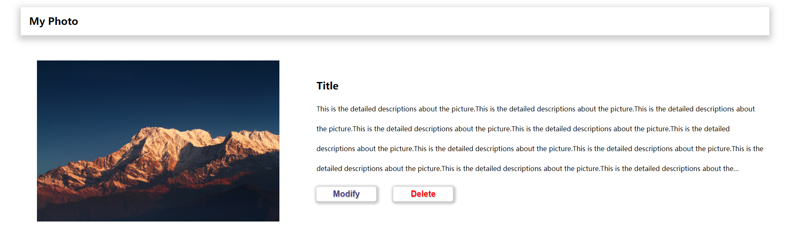
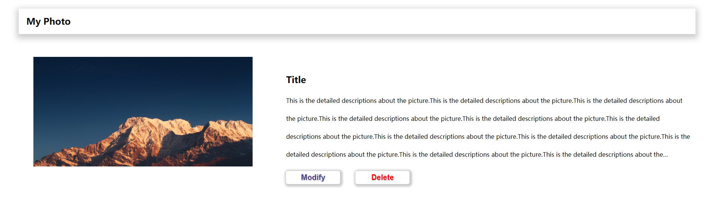

PJ1 实验报告
====================
姓名：俞晓莉
学号：18307130274
--------------------

##Github相关提交地址

[Github仓库地址](https://github.com/xefgg/Project1)

[Github Pages地址](https://xefgg.github.io/Project1/)

--------------------

##项目完成情况

所有基础要求全部完成，bonus完成大部分

为了防止网站的具体功能页面太眼花缭乱，就只是主要美化了登录、注册和主页，这三个页面比较精美，其余的页面为了保证绝大多数都用户可以
看得清，就没有对背景颜色等进一步设置了，但整体上，网站的风格还是很统一的

--------------------

##Bonus完成情况

* 完成bonus 5.1

使用的方法是，在所有需要裁剪的image外层套一个父级div：img-container

对img-container设置宽度和高度（这里的宽度和高度就是我所希望裁剪后的图片的高度和宽度）

然后相应的字级属性img的宽度和高度继承父div即可

这里给出一个my photo中的例子

我在style.css里设置好了img-container和img，这里只需要加上相应的类即可

在img-container里设置高度为400px时，图片是这样的：

接下来将img-contain的高度改为300px：

看一下效果：

可以看到，图片的下沿明显被裁剪掉了

browse.html单独又设置了img-container和img的属性，同样传进去sample这张非正方形的图片，可以看到被成功剪裁成了正方形

* 完成bonus 5.2

关于响应式，我在pj里采用的就是比较简单也普适性比较高的百分比响应式布局

即利用父子div的嵌套，子div所设置的长宽比例就是占父div的宽度的相应比例

这样子层层嵌套下来，最后的根层父div的宽度就可以决定所有的子div的宽度，
而这个父div的宽度则是由浏览器的视口宽度或者是不同设备的宽度来决定的，所以一旦设备或者是浏览器的视口宽度一定，
整个页面都会在相应的设备上进行等比例缩放，也就实现了响应式布局（前提：不过分改变浏览器的宽度）

------------------------------

